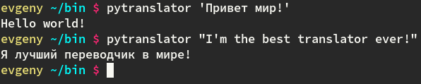

# pytranslator

**pytranlator** is a python cli program which allows you to translale words and sentencies from russian to english and vice verse. It uses [Yandex translator API](https://tech.yandex.com/translate/) and it's very accurate. 



##Instructions
1) First of all you need to install additional python library: **yandex_translate**. You can do it with [pip](https://pypi.python.org/pypi/pip) 

- ```pip install yandex_translate```

2) Then need to clone this repository ```git clone https://github.com/Evalle/pytranslator.git```

3) Also, you need to register your own API key. It's absolutely free and you can do it [here] (https://tech.yandex.com/translate/)

4) Once you got it, run **cpkey.py** script (you can find it in your pytranslator directory) and follow the instructions.

5) Now you can run **pytranslator** (see Examples section).

## Arguments
There is no other arguments except the words or sentencies that you want to translate. 

## Examples

```
$ pytranslate 'Hello my name is pytranslator'
Здравствуйте меня зовут pytranslator
```

```
$ pytranslate 'Я умею переводить с русского на английский и наоборот!'
I can translate from Russian to English and Vice versa!
```

```
$ pytranslate 'Хорошего дня!'
Have a nice day!
```

## Free software

pytranslate - Copyright (C) 2015 Evgeny Shmarnev shmarnev@gmail.com

pytranslate is a free software: you can redistribute it and/or modify it under the terms of the GNU General Public License as published by the Free Software Foundation, either version 3 of the License, or (at your option) any later version.

pytranslate is distributed in the hope that it will be useful, but WITHOUT ANY WARRANTY; without even the implied warranty of MERCHANTABILITY or FITNESS FOR A PARTICULAR PURPOSE. See the GNU General Public License for more details.
